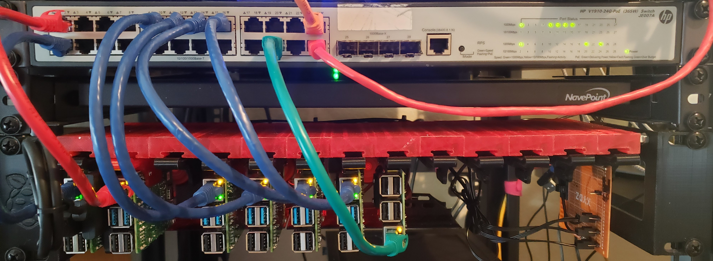

# Home K8s Cluster

I have been wanting to take a deep dive into Kuber

This is a repo to hold various deployments for my home microk8s cluster with 4x RPi 4 8GB worker nodes. 


## Rack Mount
I 3D printed [this](https://www.thingiverse.com/thing:4756812) design from thiniverse that will allow for 14 RPi sleds with the mouting holes for a 2.5" SSD on each. Currently I just have one Pi that has a SSD that is running a NFS server that the NFS `StorageClass` uses to dynamically provision persistant storage for the pods.

The master node is a 4GB Pi 4, and the 4 worker nodes are 8GB Pi 4's all powered via PoE with the official PoE Hat. The PoE switch I am using is a `HP V1910-24G-PoE JE007A` that I picked up from [FreeGeek](https://www.freegeekarkansas.org/), a local computer recycling center and shop.

In addition to the small amount of cooling the PoE hat fan provides, there are 80mm fans on the back of the rack pulling air across the Pi's for extra cooling.




`journalctl -u snap.microk8s.daemon-kubelet`


# Pod not scheduling?
```bash
kubectl get nodes -o wide
kubectl get events

// View Logs
kubectl logs <POD_NAME>
```


# Aliases

```bash
alias kubedebug="kubectl run -i --tty --rm debug --image=busybox --restart=Never --"
```
https://betterprogramming.pub/useful-kubectl-aliases-that-will-speed-up-your-coding-54960185d10`

https://www.jeffgeerling.com/blog/2020/raspberry-pi-cluster-episode-4-minecraft-pi-hole-grafana-and-more

https://www.careyscloud.ie/pihole_metallb

https://github.com/carlosedp/cluster-monitoring#quickstart-for-k3s